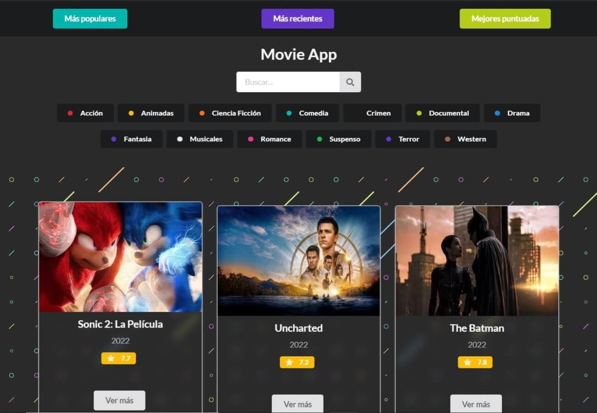
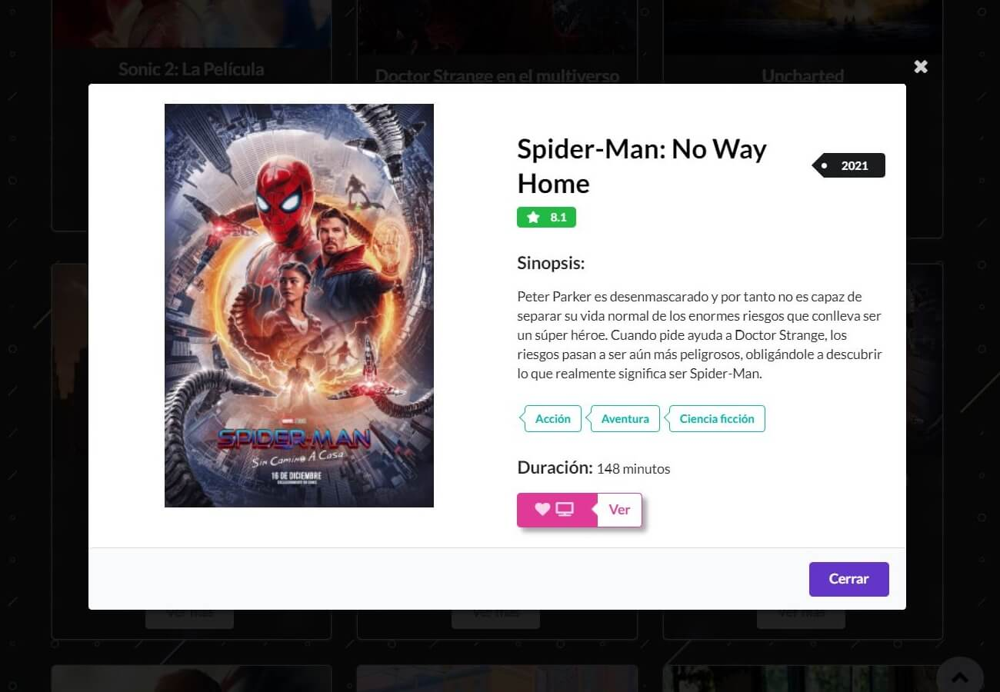
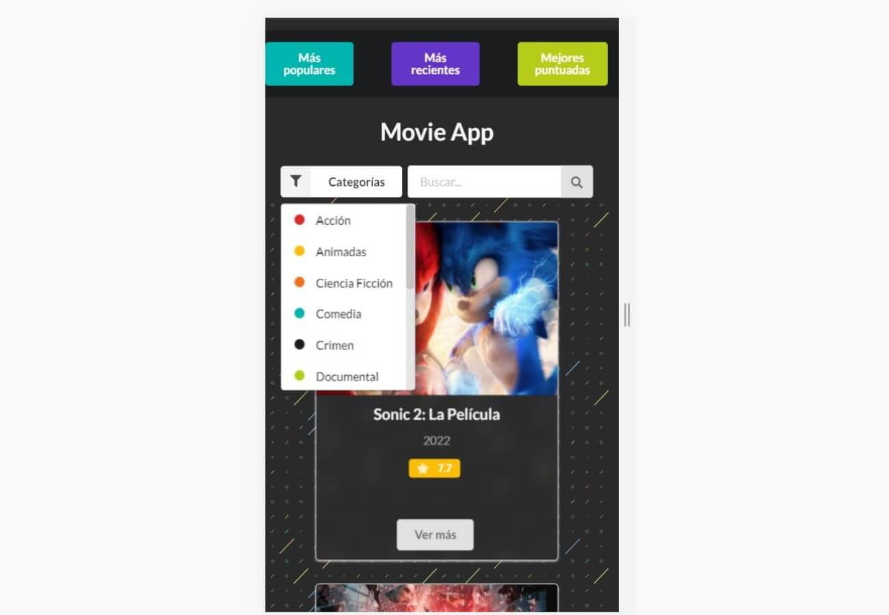

# Movie App
Sitio web responsive, desarrollado con Javascript y Semantic UI, donde se consume TMDB API.

## Demo - Movie App
### Web
[Movie App](https://victorianastasi.github.io/movieApp/) 

### Desktop

### Mobile

## UI
- Semantic UI

## Author
GitHub: [victorianastasi](https://github.com/victorianastasi)

LinkedIn:  [Victoria Nastasi](https://www.linkedin.com/in/victoria-nastasi-74b007237/)